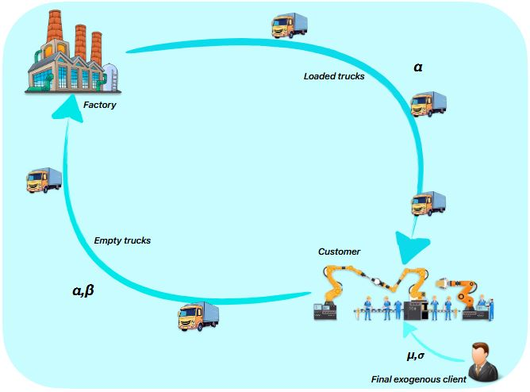
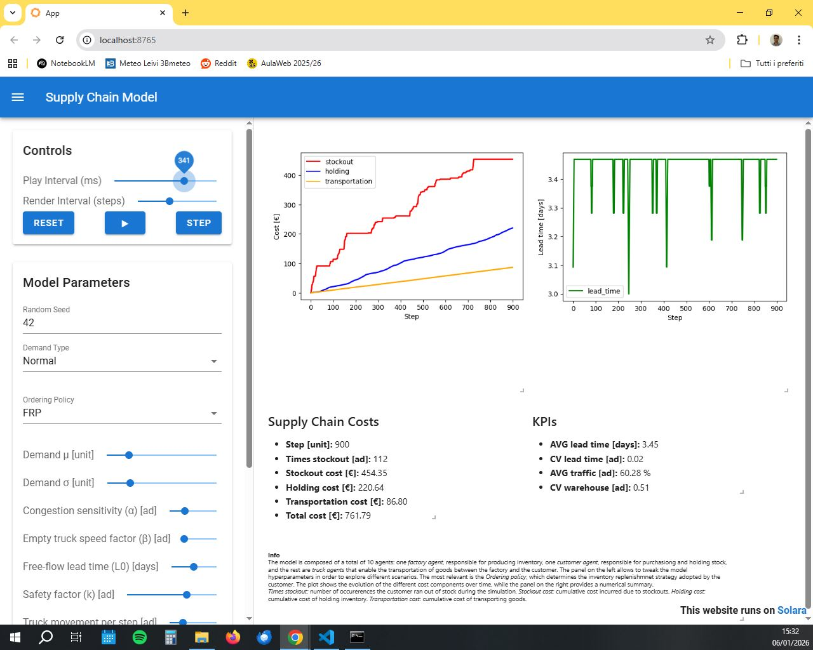

# Agent-Based Modeling (ABM) for Single-Echelon Supply Chain Simulation

This repository contains the Python implementation of the Agent-Based Model (ABM) developed in the paper:

> **Risk-Aware Inventory Management: Analyzing Reorder Policies Under Demand Uncertainty and Congestion**

The simulation models a single-echelon supply chain and analyzes inventory reorder policies under demand uncertainty and congestion effects.

<p align="center">
   
   <figcaption align="center">Schema of the logic of the dashboard</figcaption> 
</p>

We model the relation between the single couple: factory-customer, with multiple truck agents, as many as the user inserts from the hyperparameters panel.

The model is implemented using the **[Mesa](https://mesa.readthedocs.io/latest/)** framework and rendered as an interactive dashboard using **[Solara](https://solara.dev/documentation)**.

---

## Requirements

- Python (version as specified in `requirements.txt`)
- Required Python libraries (see `requirements.txt`)

---

## Installation

1. Clone the repository or download the `solara` folder manually:
   ```bash
   git clone <repository-url>

2. Navigate to the `solara` folder:
   ```bash
   cd solara
  
3. Install the required dependencies:
   ```bash
   pip install -r requirements.txt
   ```
4. Make sure to have Python installed, and `pip` working properly from `cmd`.
---

## Usage
From inside the solara folder, run:
```bash
solara run app.py
```
The dashboard will be available at:
```bash
http://127.0.0.1:8765/
```

---

## Dashboard Preview
<p align="center">  </p>

---

## Citation

> ter Hoeven, E., Kwakkel, J., Hess, V., Pike, T., Wang, B., rht, & Kazil, J. (2025).  
> **Mesa 3: Agent-based modeling with Python in 2025**.  
> *Journal of Open Source Software*, 10(107), 7668.  
> https://doi.org/10.21105/joss.07668
